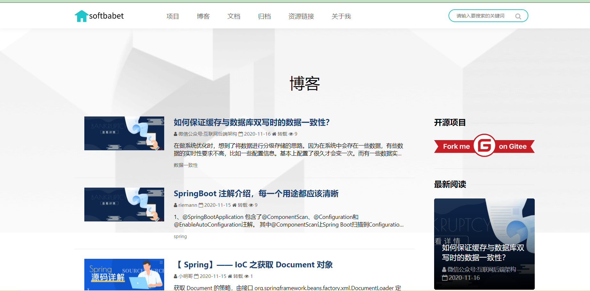
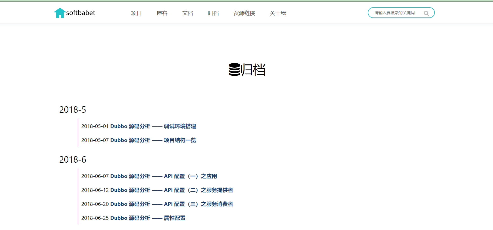
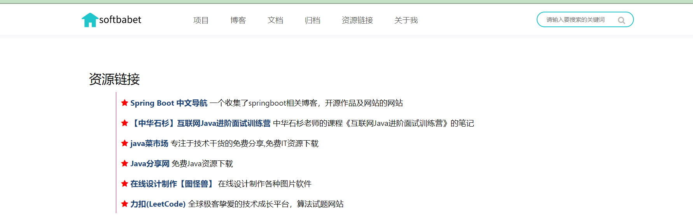
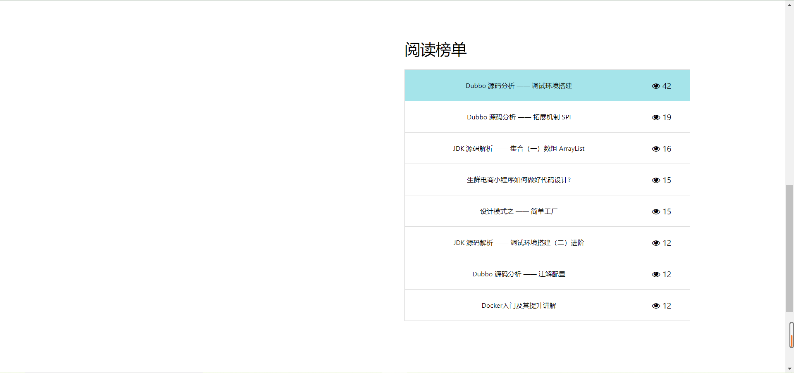
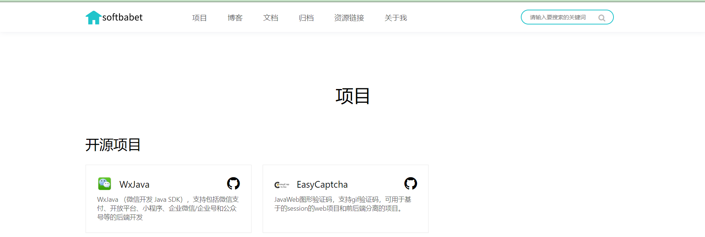

#  炫酷且全面的博客：yn-blog

   

 **如果对您有帮助，您可以点右上角 "`Star`" 支持一下 谢谢！**

 **如果您想获悉项目实时更新信息，您可以点右上角 感谢您的支持！**

 **本项目还在不断开发完善中,如有建议或问题请通`Issues`反馈！**

###  项目介绍

​     Yn-blog是基于SpringBoot+Freemarker+MybatisPlus+Bootstrap 研发的博客项目，致力于做更简洁炫酷且全面的，开箱即用，快速部署的博客系统项目。系统实现了博客首页展示可更换，博客文章可按标签分类系列归类，文档的编写展示，文章的目录展示，热门文章及最新文章的排序，项目的展示，本系统文章采用的是markdown文本编辑。项目可以PC端及移动端的能自适应，提高读者的体验。操作体验流畅，使用非常优化，欢迎大家使用及进行二次开发。

- SpringBoot+ Bootstrap 开发出来的框架。
- 支持MySQ数据库类型。模块化设计，层次结构清晰。
- 目前兼容浏览器（Chrome、Firefox、360浏览器等）
- 适用范围：可以用于个人的博客搭建。

### 功能特性

- **严谨规范：** 提供一套有利于团队协作的结构设计、编码、数据等规范。
- **严谨安全：** 清晰的系统执行流程，严谨的异常检测和安全机制，详细的日志统计，为系统保驾护航。
- **简单上手快：** 结构清晰、代码规范、在开发快速的同时还兼顾性能的极致追求。
- **基于SpringBoot** 简化了大量项目配置和maven依赖，让您更专注于业务开发，独特的分包方式，代码多而不乱。
- **利用Freemarker模板引擎** 使臃肿的html代码变得简洁，更加易维护。

### 开发者信息

- 系统名称：yn-blog博客系统
- 作者：softbabet
- 邮箱：yuanjs625@163.com

### 页面演示

- 博客地址：[http://114.67.107.180/ynblog](http://114.67.107.180/ynblog)

  
### 数据库表

